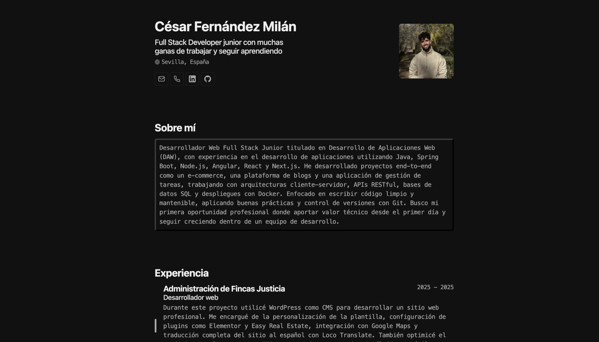

# Minimalist Portfolio

Portfolio personal y CV web de César Fernández Milán, construido con Astro a partir de un esquema JSON editable.



## Qué incluye

- Presentación personal, experiencia, formación y stack técnico.
- Contenido editable desde `cv.json` y `cv_english.json`.
- Rutas en español e inglés.
- Diseño pensado para consultar en web y exportar/imprimir como CV.

## Stack

- [Astro](https://astro.build/)
- [TypeScript](https://www.typescriptlang.org/)
- [Ninja Keys](https://github.com/ssleptsov/ninja-keys)

## Estructura principal

- `cv.json`: contenido principal en español.
- `cv_english.json`: contenido para la versión en inglés.
- `src/pages/es/index.astro`: entrada de la versión en español.
- `src/pages/en/index.astro`: entrada de la versión en inglés.

## Desarrollo local

Instala dependencias y arranca el proyecto:

```bash
npm install
npm run dev
```

La aplicación estará disponible en `http://localhost:4321`.

## Scripts

| Comando | Descripción |
| :-- | :-- |
| `npm run dev` | Inicia el entorno de desarrollo. |
| `npm run build` | Genera la versión de producción en `dist/`. |
| `npm run preview` | Sirve localmente la build de producción. |

## Personalización

Si quieres adaptar este portfolio:

1. Edita `cv.json` con tu información personal, experiencia y proyectos.
2. Sustituye la imagen de perfil definida en `basics.image`.
3. Ajusta textos o secciones en `src/components/sections/`.

## Build de producción

```bash
npm run build
```

Si la compilación termina sin errores, el sitio queda listo en `dist/`.
